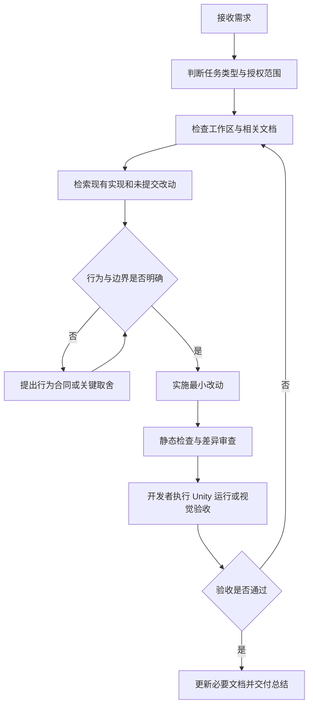

# Tiny Nations AI 协作工作流

> 适用项目：Tiny Nations（小小国家）  
> 适用阶段：当前单位战斗、导航与小规模 RTS 垂直切片开发  
> 核心原则：先建立事实，再确定行为；只做当前需要的最小改动；运行结果由 Unity 实际表现验收。

## 1. 工作流目标

这份工作流用于规范开发者与 AI 在 Tiny Nations 中的协作方式，重点解决四个问题：

1. AI 开始工作前应该先看什么；
2. 哪些任务可以直接实施，哪些任务必须先讨论行为；
3. 如何避免破坏 Unity 资产、用户改动和框架边界；
4. 如何区分“代码已写”“静态检查通过”和“Unity 运行验收完成”。

它不替代 [`AGENTS.md`](AGENTS.md) 中的约束，也不替代 `Assets/Doc` 中的开发规范。发生冲突时，按以下优先级执行：

```text
用户本次明确要求
    ↓
AGENTS.md
    ↓
专项规范或项目 Skill
    ↓
Assets/Doc 中的项目文档
    ↓
本工作流
```

## 2. 人与 AI 的职责边界

### AI 负责

- 检索当前工作区，建立与本次任务直接相关的代码和资源上下文；
- 区分现有行为、未提交改动、历史结论和规划内容；
- 对存在取舍的方案给出具体比较，并说明推荐理由；
- 在行为已明确时完成小范围实现或文档修改；
- 保护无关修改，不覆盖、不回退、不顺手重构；
- 执行轻量静态检查，并如实报告未验证部分；
- 给出短而明确的 Unity 手动验收步骤。

### 开发者负责

- 决定会改变玩法体验或系统边界的行为合同；
- 默认负责 Unity 编译、Play Mode、视觉效果和手感验收；
- 决定是否接受外部依赖、Package 版本或架构范围变化；
- 负责 Git 暂存、提交和推送，除非本次明确交给 AI。

### AI 默认不做

- 未经要求运行 Unity CLI、进入 Play Mode、生成测试单位或执行长时间验证；
- 未经要求修改 Package 版本、第三方源码或工具生成代码；
- 手工修改 Unity 生成的 `.csproj`；
- 把静态代码、历史日志或旧构建结果描述成当前运行验收；
- 为未来需求提前加入行为树、GOAP、通用阵营、联网、热更新等系统。

## 3. 任务类型与处理方式

| 用户意图 | AI 的默认动作 | 是否修改文件 |
| --- | --- | --- |
| “看看、熟悉、评审、分析” | 检索并阅读，输出发现、风险和建议 | 否 |
| “讨论、设计、应该怎么做” | 形成行为合同和方案比较，等待关键选择明确 | 否 |
| “实现、修改、修复、整理” | 读取上下文后直接完成最小范围改动 | 是 |
| “为什么会这样” | 先定位原因并给出证据，不自动扩展为修复 | 否 |
| “帮我做一个 Unit” | 使用 Unit 制作规范与项目 Skill | 是 |
| “测试一下” | 先确认用户要求的验证层级；Unity 运行只在明确要求时执行 | 视任务而定 |

当一句话同时包含多个意图时，按“先确定行为，再实施，再验证”的顺序执行。

## 4. 标准工作流



### 第 1 步：确认任务目标

AI 先把需求转换为可验证结果，而不是直接从模糊描述推导大型方案。

至少明确：

- 要解决的具体问题；
- 本次允许修改的功能或目录；
- 什么现象代表完成；
- 哪些行为不在本次范围内。

只有缺失信息会明显改变结果时才提问。能够从现有代码和上下文推断的普通实现细节由 AI 自行判断。

### 第 2 步：检查工作区状态

修改前至少确认：

- 当前 Git 状态；
- 本次涉及的文件是否已有用户修改；
- 是否存在新脚本尚未被 Unity 导入的情况；
- 任务是否涉及 `.meta`、GUID、Prefab、Scene、Animator 或 ScriptableObject 引用。

发现无关修改时保留原状。发现同一文件存在用户修改时，在现有内容上做局部编辑，不整文件覆盖。

### 第 3 步：检索事实

按问题类型选择检索方式：

- 已知类名、字段名、路径、报错或 GUID：使用 `rg` 做精确检索；
- 不知道代码位置，需要理解职责、关系或调用链：使用项目语义检索；
- 同时需要精确锚点和跨文件关系：先语义定位，再用 `rg` 收敛；
- 涉及 Unity、Package 或第三方 API：先确认项目实际版本，再查对应版本的官方资料；
- 用户要求参考开源方案：比较具体实现、适用条件和代价，再选择与当前项目最匹配的方案。

检索以“足以支持本次判断”为停止条件，不为完整阅读整个项目而扩大上下文。

### 第 4 步：读取对应规范

| 任务 | 必读入口 |
| --- | --- |
| 框架、生命周期、资源所有权 | `Assets/Doc/FrameworkOverview.md`、`FrameworkNavigation.md`、`CodingStandards.md` |
| 新增或整理目录 | `Assets/Doc/DirectoryStandards.md` |
| Unit Prefab、Animator、UnitDefinition、技能配置 | `Assets/Doc/UnitPrefabAuthoring.md` 和 `.agents/skills/create-unit-prefab/SKILL.md` |
| 单位生成、回收、阵营、死亡 | `UnitSystem.cs`、`UnitEntity.cs` 和相关 Component / Logic |
| 移动与寻路 | `NavigationSystem.cs`、`UnitNavigationLogic.cs`、`UnitMovementLogic.cs` |
| 近战 AI | `UnitMeleeAILogic.cs`、`UnitAIComp.cs`、`IUnitQuery.cs`、近战技能配置 |
| 游戏流程与场景切换 | `GameBoot.cs`、`GameFlowSystem.cs` 和 `GameFlow/States` |
| UI | `FrameworkNavigation.md` 的 UI 部分及对应 View / ViewModel |

`AIDoc` 目前包含历史项目资料，不作为 Tiny Nations 当前实现的权威依据；除非任务明确指向其中某个文件，否则优先使用根目录和 `Assets/Doc`。

### 第 5 步：固定行为合同

以下任务在大改代码前必须先把行为说清楚：

- 自动索敌、目标保持、追击、脱战和返回；
- 玩家命令与自动 AI 的优先级；
- 攻击距离、碰撞距离和技能可触发条件；
- 单位死亡、尸体停留、掉落、复活或回收时机；
- 框选、编队、Attack-Move 等 RTS 操作语义；
- 会影响资源所有权、生命周期或程序集边界的架构调整。

行为合同建议使用下表：

| 项目 | 约定 |
| --- | --- |
| 触发条件 | 什么情况下开始该行为 |
| 目标选择 | 如何选择、保持和清除目标 |
| 中断规则 | 玩家命令、受击、死亡等如何中断 |
| 移动规则 | 何时寻路、停止、重新寻路或返回 |
| 结束条件 | 什么状态表示行为结束 |
| 失败处理 | 无路径、目标消失、资源失败时怎么做 |

### 第 6 步：实施最小改动

实现时遵循以下顺序：

1. 沿用现有类型、命名和目录；
2. 优先修改拥有该职责的最小层级；
3. 用已有接口完成需求，不提前抽象；
4. 业务规则放在 `GameLogic`，跨玩法稳定能力才进入 `BorFramework`；
5. 新增 Unity 资产时同时保留或生成对应 `.meta`；
6. 修改公开契约、资源规则或目录约定时同步文档；
7. Unit 规范发生实质变化时，同步更新 Unit Skill，并保持版本一致。

项目自有 C# 代码继续遵守：

- 不新增 `try`、`catch`、`finally`；
- 不使用 `throw` 处理正常业务失败；
- 优先空值检查、状态检查、`bool`、`Try` 接口和提前返回；
- 不修改第三方和自动生成代码来绕过问题。

### 第 7 步：静态检查

默认执行与改动风险相称的轻量检查：

- 重新读取修改区域，确认控制流与生命周期闭环；
- 搜索旧类型名、旧路径、遗漏引用或重复实现；
- 检查 `.meta` 与 GUID 是否随 Unity 资产正确保留；
- 检查 Unit 文档与 Skill 版本是否同步；
- 运行 `git diff --check`；
- 审查 `git diff`，确认没有无关格式化或用户改动被覆盖。

默认不替开发者运行编译。如果本次明确要求 AI 编译，可使用串行方式减少 Unity 生成项目的锁冲突：

```powershell
dotnet build "Tiny-Nations.sln" -m:1 -nr:false -p:UseSharedCompilation=false --no-restore
```

新脚本出现 `CS0246` 时，先确认 Unity AssetDatabase 已刷新、`.meta` 已生成且脚本已进入生成项目；不要直接编辑 `.csproj`。

### 第 8 步：Unity 运行验收

AI 交付时给出 3～6 个聚焦步骤，由开发者在 Unity 中执行。验收记录应包含：

- 使用的场景和对象；
- 操作步骤；
- 预期结果；
- 实际结果；
- Console 中是否出现新错误或持续警告。

不同任务的最低运行验收如下：

| 任务 | 必须观察的运行结果 |
| --- | --- |
| 单位生成与池化 | 重复生成、死亡、回收、再次生成后状态无残留 |
| 近战战斗 | 正确目标关系、攻击距离、伤害次数和动画时机 |
| 死亡流程 | 最后一次伤害、单次死亡、停止行为、LateUpdate 回收 |
| 导航 | 不穿障碍、不切角、不卡拐角、无路径时安全停止 |
| 受击表现 | 视觉正确、共享材质不被污染、池化复用后恢复 |
| UI | Scene 与 Game 视图、交互、分辨率和导航返回行为 |

### 第 9 步：交付总结

AI 的最终交付按下面的格式说明：

1. **结果**：已经完成什么；
2. **改动**：修改了哪些文件和行为；
3. **验证**：实际执行了哪些检查；
4. **待验收**：仍需要开发者在 Unity 中确认什么；
5. **范围说明**：哪些相关功能本次没有做。

统一使用以下状态，避免“完成”含义不清：

| 状态 | 含义 |
| --- | --- |
| 已实现 | 文件和逻辑已经修改 |
| 静态检查通过 | 已完成源码、引用或差异检查 |
| 编译通过 | 当前工作区执行的编译成功 |
| 运行待验收 | 尚未用当前 Unity Play Mode 证明行为 |
| 视觉待验收 | 尚未在 Game 视图确认最终表现 |
| 运行验收通过 | 当前版本已按验收步骤实际验证 |

## 5. 当前项目的专项流程

### 5.1 Unit 制作或修改

```text
阅读 UnitPrefabAuthoring
    → 使用 create-unit-prefab Skill
    → 检查现有同类 Unit
    → 修改 Prefab / Animator / Definition / 属性 / 技能
    → 检查 YooAsset address 与标签
    → 静态同步检查
    → 开发者在 Unity 中验证生成、动画、技能、死亡和回收
```

不要为每个兵种创建专属 Entity、属性类或重复运行时逻辑。兵种差异优先由数据和资源表达。

### 5.2 AI 行为开发

```text
先讨论行为合同
    → 复用 UnitCommandComp / UnitNavigationComp / SkillLogic
    → 只实现最近的一层决策
    → 分开“目标是否在范围内”和“技能当前能否触发”
    → 开发者验证追击、停步、攻击、目标死亡和重新索敌
```

第一阶段避免行为树、GOAP、威胁系统、编队、战略决策和复杂黑板。

### 5.3 导航问题修复

诊断顺序：

1. 地图的 Ground / Collision 数据是否正确；
2. 起点、终点和单位净空是否可行走；
3. 斜向移动是否穿角；
4. 起点到首个路径点是否有安全连接；
5. 路径点容差是否导致提前转弯；
6. 单位是否经过路径点但没有推进索引；
7. 是否存在可测量的卡住状态和重新寻路；
8. 最后才评估摩擦材质是否作为辅助措施。

物理材质可以帮助贴墙滑动，但不能替代路径净空和卡住恢复。

### 5.4 Bug 诊断

```text
复现描述
    → 确认当前代码与资源状态
    → 找到最短数据流或调用链
    → 区分根因、诱因和历史日志
    → 给出证据支持的结论
    → 用户要求修复时再实施
```

不要因为看到一个报错就修改第三方、Package 或生成文件。先确认错误是否来自当前域重载、当前程序集和当前运行。

### 5.5 结构整理

- 只改变目录和归属，不改变逻辑、Namespace 或 public API；
- Unity 资产与 `.meta` 一起移动，保持 GUID；
- 使用职责或功能命名目录，不使用 `Misc`、`Common2`、`New` 等模糊名称；
- 等待 Unity AssetDatabase 刷新后再判断生成项目错误；
- 整理完成后检查文档链接、Prefab、Scene 和程序集引用。

## 6. 推荐提示词模板

### 只读评审

```text
请只读评审 [功能/目录]，不要修改文件。先检查当前实现和未提交改动，说明职责、调用链、风险和最小改进建议。已实现、规划中和未验证内容要分开写。
```

### 先讨论行为

```text
先不要写代码。请结合当前项目设计 [行为]，明确触发条件、目标选择、保持与清除、中断规则、移动规则、结束条件和失败处理。给出最小方案与不建议现在引入的复杂度。
```

### 实施功能

```text
请实现 [功能]。沿用现有架构和命名，只改必要文件，不重构无关代码。完成后做静态检查，不运行 Unity；给我一组简短的 Play Mode 验收步骤。
```

### 修复问题

```text
[场景/对象] 出现 [现象]。请先从当前工作区定位根因，再做最小修复。保留无关修改，不改第三方或生成代码。说明根因、改动和我需要验证的边界情况。
```

### 制作 Unit

```text
请按项目 Unit 制作规范和 create-unit-prefab Skill 新增/修改 [单位]，复用 [参考单位] 的运行时结构。配置 Prefab、Animator、UnitDefinition、属性、技能和 YooAsset 收集，并给出 Unity 验收步骤。
```

### 整理代码

```text
请只整理 [目录] 的文件结构，不改变逻辑、Namespace 或 API。按职责命名目录，移动 Unity 文件时保留 .meta/GUID，并检查引用和文档路径。
```

## 7. 快速检查清单

### AI 开始前

- [ ] 已理解本次目标和不做的范围；
- [ ] 已检查 Git 状态和用户已有修改；
- [ ] 已读取对应规范与当前实现；
- [ ] 涉及玩法取舍时已固定行为合同；
- [ ] 涉及 Unit 时已进入专项 Skill 流程。

### AI 交付前

- [ ] 改动范围最小且职责位置正确；
- [ ] 未修改第三方、生成代码或无关内容；
- [ ] Unity 资产的 `.meta` 和 GUID 处理正确；
- [ ] 资源、订阅、帧回调和对象生命周期闭环；
- [ ] 已审查差异并执行适当静态检查；
- [ ] 已区分已实现、已编译、运行待验收和视觉待验收；
- [ ] 已提供简短、可重复的 Unity 验收步骤。

### 开发者验收后

- [ ] 当前 Console 没有新增错误；
- [ ] 目标行为在实际场景中成立；
- [ ] 重复进入、退出、生成和回收后状态仍正确；
- [ ] 边界情况没有破坏现有功能；
- [ ] 验收通过后再由开发者决定暂存、提交和推送。

