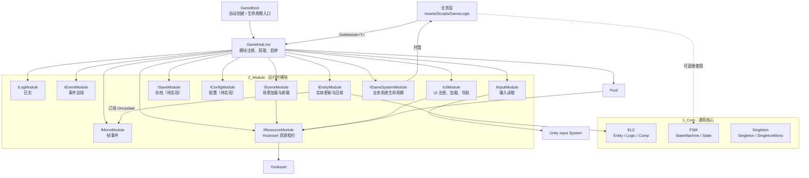
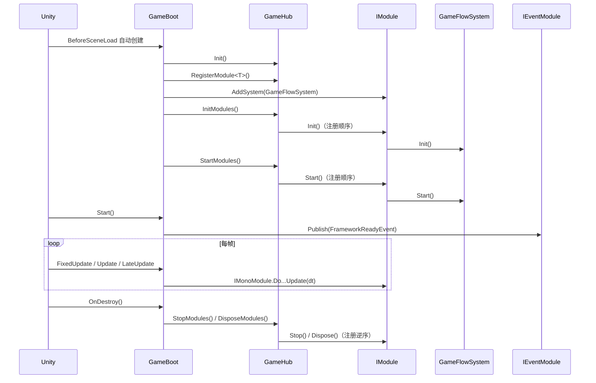
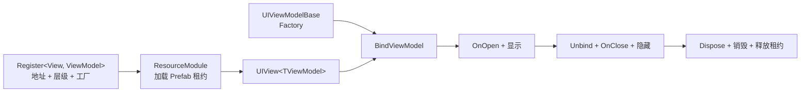
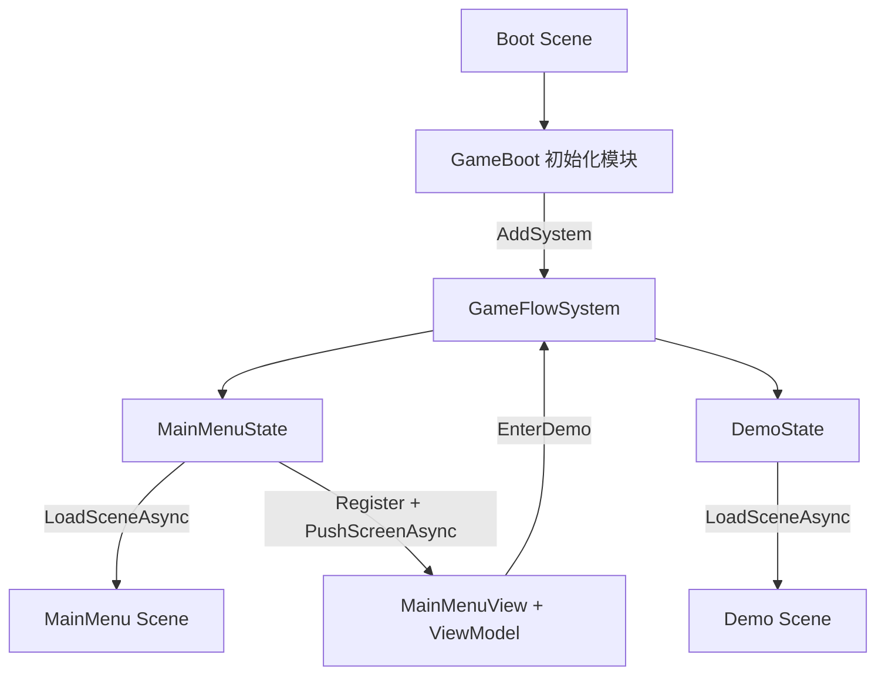

# BorFramework 框架导航与 API 索引

> 面向日常开发的快速入口。本文按当前工作区代码整理，API 以接口文件为准，业务接入参考 `Assets/Scripts/GameLogic/GameFlow` 与 `MainMenu`。

## 1. 一图定位框架



目录分层：

- `1_Core`：不面向具体业务的基础结构，如 Hub、ELC、FSM、单例。
- `2_Module`：由 `GameHub` 托管生命周期的服务模块，业务代码优先依赖 `I...Module` 接口。
- `3_Boot`：框架自动启动、模块注册和 Unity 帧回调转发。
- `GameLogic`：项目业务代码；当前正式入口由 `GameFlow` 组织，具体界面放在对应功能目录。

## 2. 最常用入口

业务代码统一从 `GameHub` 获取模块：

```csharp
var resourceModule = GameHub.Ins.GetModule<IResourceModule>();
var prefabPoolModule = GameHub.Ins.GetModule<IPrefabPoolModule>();
var eventModule = GameHub.Ins.GetModule<IEventModule>();
var uiModule = GameHub.Ins.GetModule<IUIModule>();
```

| 要做什么 | 找哪个模块 / 类型 | 首选 API | 接口 / 基类 |
| --- | --- | --- | --- |
| 加载 Prefab、材质等资源 | `IResourceModule` | `LoadAssetAsync<T>(address)` | [`IResourceModule.cs`](../Scripts/BorFramework/2_Module/ResourceModule/IResourceModule.cs) |
| 高频创建和回收 Prefab | `IPrefabPoolModule` | `RentAsync` / `Return` | [`IPrefabPoolModule.cs`](../Scripts/BorFramework/2_Module/PrefabPoolModule/IPrefabPoolModule.cs) |
| 加载、卸载、激活场景 | `ISceneModule` | `LoadSceneAsync` / `UnloadSceneAsync` / `SetActiveScene` | [`ISceneModule.cs`](../Scripts/BorFramework/2_Module/SceneModule/ISceneModule.cs) |
| 注册和打开 UI | `IUIModule` | `Register` / `OpenAsync` / `PushScreenAsync` / `OpenWindowAsync` | [`IUIModule.cs`](../Scripts/BorFramework/2_Module/UIModule/IUIModule.cs) |
| 发送或监听业务事件 | `IEventModule` | `Publish` / `Subscribe` / `Unsubscribe` | [`IEventModule.cs`](../Scripts/BorFramework/2_Module/EventModule/IEventModule.cs) |
| 读取 Input Action | `IInputModule` | `ReadVector2` / `ReadFloat` / `IsPressed` | [`IInputModule.cs`](../Scripts/BorFramework/2_Module/InputModule/IInputModule.cs) |
| 订阅 Unity 帧循环 | `IMonoModule` | `OnFixUpdate` / `OnUpdate` / `OnLateUpdate` | [`IMonoModule.cs`](../Scripts/BorFramework/2_Module/MonoModule/IMonoModule.cs) |
| 注册实体并驱动其 Logic | `IEntityModule` + `Entity` | `AddEntity` / `RemoveEntity` | [`IEntityModule.cs`](../Scripts/BorFramework/2_Module/EntityModule/IEntityModule.cs) |
| 托管一个业务系统 | `IGameSystemModule` + `IGameSystem` | `AddSystem` / `GetSystem` | [`IGameSystemModule.cs`](../Scripts/BorFramework/2_Module/GameSystemModule/IGameSystemModule.cs) |
| 建立状态机 | `StateMachine` + `State` | `AddState` / `ChangeState<T>` / `Update` | [`StateMachine.cs`](../Scripts/BorFramework/1_Core/FSM/StateMachine.cs) |
| 输出日志 | `ILogModule` | `Log` / `Waring` / `Error` | [`ILogModule.cs`](../Scripts/BorFramework/2_Module/LogModule/ILogModule.cs) |
| 存档 | `ISaveModule` | 当前仅有生命周期，无业务 API | [`ISaveModule.cs`](../Scripts/BorFramework/2_Module/SaveModule/ISaveModule.cs) |
| 配置 | `IConfigModule` | 当前仅有生命周期，无业务 API | [`IConfigModule.cs`](../Scripts/BorFramework/2_Module/ConfigModule/IConfigModule.cs) |

> `ILogModule.Waring` 是当前代码中的真实拼写，调用时不要写成 `Warning`。

## 3. 启动与生命周期



模块注册顺序定义在 [`GameBoot.cs`](../Scripts/GameLogic/GameBoot.cs)：

1. `ILogModule`
2. `IMonoModule`
3. `IEventModule`
4. `IInputModule`
5. `IEntityModule`
6. `IResourceModule`
7. `IPrefabPoolModule`
8. `ISaveModule`
9. `IConfigModule`
10. `ISceneModule`
11. `IUIModule`
12. `IGameSystemModule`

所有模块实现统一生命周期 [`IModule`](../Scripts/BorFramework/1_Core/Hub/IModule.cs)：`Init → Start → Stop → Dispose`。新增模块时，接口应继承 `IModule`，实现放在 `2_Module` 对应目录，并在 `GameBoot.Init()` 中按依赖顺序注册。

## 4. 模块 API 速查

### 4.1 Hub：模块容器

源码：[`IHub.cs`](../Scripts/BorFramework/1_Core/Hub/IHub.cs) · [`GameHub.cs`](../Scripts/BorFramework/1_Core/Hub/GameHub.cs)

| API | 用途 / 约束 |
| --- | --- |
| `GameHub.Ins` | 框架全局入口。 |
| `RegisterModule<T>(T module)` | 按接口类型 `T` 注册；相同类型重复注册不会覆盖。 |
| `GetModule<T>()` | 按注册时使用的类型 `T` 获取；不存在时返回 `null`。 |
| `InitModules()` / `StartModules()` | 按注册顺序执行。 |
| `StopModules()` / `DisposeModules()` | 按注册逆序执行。 |
| `IsInitialized` / `IsRunning` | 判断 Hub 是否已初始化、是否运行中。 |

### 4.2 Resource：YooAsset 资源访问

源码：[`IResourceModule.cs`](../Scripts/BorFramework/2_Module/ResourceModule/IResourceModule.cs) · [`IAssetLease.cs`](../Scripts/BorFramework/2_Module/ResourceModule/IAssetLease.cs) · [`ResourceModule.cs`](../Scripts/BorFramework/2_Module/ResourceModule/ResourceModule.cs)

| API | 返回 / 行为 |
| --- | --- |
| `State` | `None / Initializing / Ready / Failed / Disposed`。 |
| `PackageName` | 当前 YooAsset Package 名。默认 `DefaultPackage`。 |
| `LoadAssetAsync<T>(address)` | 等待初始化结束后异步加载；失败返回 `null`。 |
| `LoadAsset<T>(address)` | 仅 `Ready` 时可同步加载；否则返回 `null`。 |
| `IAssetLease<T>.Asset` | 实际 Unity 资源对象。 |
| `IAssetLease<T>.IsValid` | 租约与资源是否仍有效。 |
| `IAssetLease<T>.Dispose()` | 释放 YooAsset Handle；资源不再使用时必须调用。 |

```csharp
var lease = await resourceModule.LoadAssetAsync<GameObject>("Player");
if (lease == null)
    return;

var player = Object.Instantiate(lease.Asset);
// player 和资源不再使用后：
Object.Destroy(player);
lease.Dispose();
```

资源地址来自 [`BundleCollectorSetting.asset`](../BundleCollectorSetting.asset)，不要把磁盘路径当作 address。

### 4.3 PrefabPool：Prefab 实例复用

源码：[`IPrefabPoolModule.cs`](../Scripts/BorFramework/2_Module/PrefabPoolModule/IPrefabPoolModule.cs) · [`PrefabPoolModule.cs`](../Scripts/BorFramework/2_Module/PrefabPoolModule/PrefabPoolModule.cs)

| API | 用途 / 约束 |
| --- | --- |
| `RentAsync(address, position, rotation, parent)` | 返回尚未激活的 GameObject；失败返回 `null`。 |
| `Return(instance)` | 将 GameObject 归还原池桶；陌生实例或重复归还返回 `false`。 |

池模块只负责 GameObject、容量和 Prefab 资源租约。Entity、属性、技能、队伍等运行时状态由业务 System 重建和清理。
租出和归还只切换实例父节点，不直接调用场景迁移接口。无父节点的实例保留在池模块的常驻场景中，业务生命周期结束时必须主动归还。

### 4.4 Scene：场景导航

源码：[`ISceneModule.cs`](../Scripts/BorFramework/2_Module/SceneModule/ISceneModule.cs) · [`SceneModule.cs`](../Scripts/BorFramework/2_Module/SceneModule/SceneModule.cs)

| API | 用途 / 约束 |
| --- | --- |
| `LoadSceneAsync(address, mode)` | 支持 `Single` 和 `Additive`；成功返回 `true`。 |
| `UnloadSceneAsync(address)` | 只卸载本模块记录的场景，且不会卸载最后一个已加载场景。 |
| `SetActiveScene(address)` | 将已由本模块加载的场景设为 Active Scene。 |
| `TryGetScene(address, out scene)` | 查询已加载且仍有效的场景。 |
| `ActiveScene` | Unity 当前 Active Scene。 |
| `IsBusy` | 加载或卸载期间为 `true`；忙碌时新的场景操作返回 `false`。 |

场景加载示例：[`MainMenuState.cs`](../Scripts/GameLogic/GameFlow/States/MainMenuState.cs) · [`DemoState.cs`](../Scripts/GameLogic/GameFlow/States/DemoState.cs)。

### 4.5 UI：MVVM、分层与导航栈

源码：[`IUIModule.cs`](../Scripts/BorFramework/2_Module/UIModule/IUIModule.cs) · [`UIModule.cs`](../Scripts/BorFramework/2_Module/UIModule/UIModule.cs)



| API | 用途 / 约束 |
| --- | --- |
| `Register<TView,TViewModel>(address, layer, factory, subLayer)` | 使用 View 类型作为唯一键；打开前必须注册。 |
| `OpenAsync<TView>()` | 打开任意已注册 UI，不改变 Screen / Window 导航栈。 |
| `PushScreenAsync<TView>()` | 仅接受 `EUILayer.Screen`；暂停前一 Screen，并关闭所有 Window。 |
| `OpenWindowAsync<TView>()` | 仅接受 `EUILayer.Window`，并要求 Screen 栈非空。 |
| `Close<TView>()` | 关闭指定 UI，并同步清理它所在的导航栈。 |
| `Destroy<TView>()` | 关闭、销毁实例与 ViewModel、释放资源租约并取消注册。 |
| `TryGet<TView>(out view)` / `IsOpen<TView>()` | 查询实例和打开状态。 |
| `PopScreen()` | 关闭所有 Window、弹出当前 Screen、恢复前一 Screen。 |
| `Back()` | 优先关闭栈顶 Window，否则弹出 Screen。 |

UI 基类与扩展点：

| 类型 | 关键 API |
| --- | --- |
| [`UIView<TViewModel>`](../Scripts/BorFramework/2_Module/UIModule/Base/UIView.cs) | 实现 `OnBind()`；用 `Bind(property, listener)` 自动管理解绑。 |
| [`UIViewModelBase`](../Scripts/BorFramework/2_Module/UIModule/Base/UIViewModelBase.cs) | `OnOpen / OnPause / OnResume / OnClose / Dispose`。 |
| [`BindableProperty<T>`](../Scripts/BorFramework/2_Module/UIModule/Binding/BindableProperty.cs) | `Value / Subscribe / Unsubscribe / Clear`；订阅时立即回调当前值。 |
| [`WorldUIElementBase`](../Scripts/BorFramework/2_Module/UIModule/Base/WorldUIElementBase.cs) | `Bind(target, offset) / Unbind()`；不参与 Screen 和 Window 栈。 |
| [`UIRoot`](../Scripts/BorFramework/2_Module/UIModule/Layer/UIRoot.cs) | `GetLayer(layer[, subLayer])`；启动时自动创建 Canvas 和全部层。 |

层级从低到高：`World → Screen → Window → Popup → GlobalOverlay`；每层包含 `Layer1 / Layer2 / Layer3` 三个子层。

完整接入示例：[`MainMenuState.cs`](../Scripts/GameLogic/GameFlow/States/MainMenuState.cs) · [`MainMenuView.cs`](../Scripts/GameLogic/MainMenu/UI/MainMenuView.cs) · [`MainMenuViewModel.cs`](../Scripts/GameLogic/MainMenu/UI/MainMenuViewModel.cs)。

### 4.6 Event：进程内事件总线

源码：[`IEventModule.cs`](../Scripts/BorFramework/2_Module/EventModule/IEventModule.cs) · [`IEvent.cs`](../Scripts/BorFramework/2_Module/EventModule/IEvent.cs)

```csharp
public readonly struct HealthChangedEvent : IEvent
{
    public readonly int Value;
    public HealthChangedEvent(int value) => Value = value;
}

eventModule.Subscribe<HealthChangedEvent>(OnHealthChanged);
eventModule.Publish(new HealthChangedEvent(10));
eventModule.Unsubscribe<HealthChangedEvent>(OnHealthChanged);
```

- 事件类型必须是实现 `IEvent` 的 `struct`。
- 持有订阅的对象应在关闭或销毁时调用 `Unsubscribe`。
- `Dispose()` 会清空全部监听器。

### 4.7 Input：按 Action 名读取输入

源码：[`IInputModule.cs`](../Scripts/BorFramework/2_Module/InputModule/IInputModule.cs) · [`InputModule.cs`](../Scripts/BorFramework/2_Module/InputModule/InputModule.cs)

| API | 适用值 |
| --- | --- |
| `ReadVector2(actionName)` | 移动、视角等二维输入。 |
| `ReadFloat(actionName)` | 轴、扳机等标量输入。 |
| `IsPressed(actionName)` | 当前是否按住。 |
| `WasPressedThisFrame(actionName)` | 本帧按下。 |
| `WasReleasedThisFrame(actionName)` | 本帧释放。 |

默认 InputActionAsset：[`DefultInputSystem.inputactions`](../Resources/Input/DefultInputSystem.inputactions)。找不到 Action 时返回零值或 `false` 并记录警告。

### 4.8 Mono：Unity 帧回调桥接

源码：[`IMonoModule.cs`](../Scripts/BorFramework/2_Module/MonoModule/IMonoModule.cs) · [`MonoModule.cs`](../Scripts/BorFramework/2_Module/MonoModule/MonoModule.cs)

```csharp
monoModule.OnUpdate += OnUpdate;
// 不再使用时：
monoModule.OnUpdate -= OnUpdate;
```

- `OnFixUpdate` 对应 `GameBoot.FixedUpdate`。
- `OnUpdate` 对应 `GameBoot.Update`。
- `OnLateUpdate` 对应 `GameBoot.LateUpdate`。
- `DoFixedUpdate / DoUpdate / DoLateUpdate` 是启动层的转发入口，普通业务通常只订阅事件。

### 4.9 Entity / Logic / Component：ELC

源码目录：[`ELC`](../Scripts/BorFramework/1_Core/ELC) · 管理模块：[`IEntityModule.cs`](../Scripts/BorFramework/2_Module/EntityModule/IEntityModule.cs)

```mermaid
flowchart LR
    Mono["IMonoModule.OnUpdate"] --> EntityModule["EntityModule"]
    EntityModule -->|Tick(dt)| Entity["Entity"]
    Entity -->|按 Phase 排序| Logic["Logic.OnUpdate(dt)"]
    Entity --> Comp["IComp<br/>纯 C# 或 MonoBehaviour 数据/能力"]
```

| 类型 | API / 扩展方式 |
| --- | --- |
| `IEntityModule` | `AddEntity<T>(entity)`；`RemoveEntity(entity)` 会调用实体 `Dispose()`。 |
| `Entity` | 子类构造时调用受保护的 `AddComp / AddLogic / GetComp / GetLogic`。 |
| `Logic` | 实现 `OnTick(dt)`；可覆写 `Phase / OnStart / OnStop / Dispose`。 |
| `Logic.Block / UnBlock` | 使用计数式阻塞；阻塞期间停止 Tick，解除全部阻塞后重新 `OnStart`。 |
| `IComp` | 仅约定 `Entity` 引用；使用 `Comp` 或 `CompMono` 作为基类。 |

`ELogicPhase` 执行顺序：`Input(100) → Command(200) → Navigation(300) → Movement(400) → Targeting(500) → Combat(600) → StatusEffect(700) → Cleanup(800) → Presentation(900)`。

当前正式流程暂未接入具体 `Entity / Logic`，新增玩法对象时按上述 API 组合即可。

### 4.10 GameSystem：业务系统生命周期

源码：[`IGameSystem.cs`](../Scripts/BorFramework/2_Module/GameSystemModule/IGameSystem.cs) · [`IGameSystemModule.cs`](../Scripts/BorFramework/2_Module/GameSystemModule/IGameSystemModule.cs) · [`GameSystemModule.cs`](../Scripts/BorFramework/2_Module/GameSystemModule/GameSystemModule.cs)

| API | 用途 / 约束 |
| --- | --- |
| `AddSystem<T>(T system)` | 按泛型类型注册；重复类型不覆盖。模块已初始化或启动时，会立即补调对应生命周期。 |
| `GetSystem<T>()` | 获取已注册的业务系统；不存在时返回 `null`。 |
| `IGameSystem` | 实现 `Init / Start / Stop / Dispose`。 |

系统按添加顺序初始化、启动，按逆序停止、释放。跨多个模块组织一项长期运行的业务功能时使用它；简单的一次性流程无需额外创建 System。

### 4.11 FSM：轻量状态机

源码：[`StateMachine.cs`](../Scripts/BorFramework/1_Core/FSM/StateMachine.cs) · [`State.cs`](../Scripts/BorFramework/1_Core/FSM/State.cs)

| API | 用途 / 返回值 |
| --- | --- |
| `AddState(state)` | 添加并绑定状态；空值或重复类型返回 `false`。 |
| `ChangeState<T>()` | 调用旧状态 `OnExit`、新状态 `OnEnter`；找不到或重复切换返回 `false`。 |
| `IsCurrent<T>()` | 判断当前状态类型。 |
| `Update(dt)` | 驱动当前状态 `OnUpdate`。 |
| `Stop()` | 退出当前状态并清空当前引用。 |
| `Clear()` | `Stop` 后移除全部状态。 |

### 4.12 Log / Save / Config

- [`ILogModule`](../Scripts/BorFramework/2_Module/LogModule/ILogModule.cs)：`Log`、`Waring`、`Error`，当前直接转发到 `UnityEngine.Debug`。
- [`ISaveModule`](../Scripts/BorFramework/2_Module/SaveModule/ISaveModule.cs)：当前仅实现空生命周期，尚无存档 API。
- [`IConfigModule`](../Scripts/BorFramework/2_Module/ConfigModule/IConfigModule.cs)：当前仅实现空生命周期，尚无配置 API。

## 5. 当前业务端到端调用链



查完整业务样板时按以下顺序阅读：

1. [`GameBoot.cs`](../Scripts/GameLogic/GameBoot.cs)：模块与全程业务 System 的应用组装入口。
2. [`GameFlowSystem.cs`](../Scripts/GameLogic/GameFlow/GameFlowSystem.cs)：System 生命周期和状态机驱动。
3. [`MainMenuState.cs`](../Scripts/GameLogic/GameFlow/States/MainMenuState.cs)：场景加载、UI 注册和页面打开。
4. [`MainMenuViewModel.cs`](../Scripts/GameLogic/MainMenu/UI/MainMenuViewModel.cs)：业务回调暴露给 View。
5. [`MainMenuView.cs`](../Scripts/GameLogic/MainMenu/UI/MainMenuView.cs)：按钮绑定与交互入口。

## 6. 常见新增需求放在哪里

| 新需求 | 建议落点 |
| --- | --- |
| 新的全局基础服务 | `BorFramework/2_Module/<Name>Module`，提供接口和实现，并由 `GameBoot` 注册。 |
| 一组有独立生命周期的业务规则 | `GameLogic/<Feature>` 中实现 `IGameSystem`，由 `IGameSystemModule.AddSystem` 托管。 |
| 可更新的场景对象 | 继承 `Entity`，把分阶段行为拆为 `Logic`，通过 `IEntityModule` 注册。 |
| 短期跨对象通知 | 定义 `readonly struct : IEvent`，通过 `IEventModule` 发布和订阅。 |
| 页面或窗口 | `UIView<TViewModel>` + `UIViewModelBase`，先向 `IUIModule` 注册再打开。 |
| 世界血条、名字等跟随 UI | 继承 `WorldUIElementBase`；它不进入 Screen / Window 导航栈。 |
| 资源或场景 | 先在 YooAsset 收集配置中建立 address，再通过 `IResourceModule` / `ISceneModule` 访问。 |
| 角色或流程状态切换 | `StateMachine` + 多个 `State` 子类，由所属 Entity 或 System 主动 `Update`。 |

## 7. 开发时容易踩的约束

- `GameHub.GetModule<T>()` 的 `T` 必须与注册时的泛型类型一致；当前统一按接口类型注册。
- `ResourceModule.Init()` 异步启动 YooAsset，异步加载会等待状态离开 `Initializing`，同步加载不会等待。
- 任何 `IAssetLease<T>` 都代表资源引用所有权，持有者负责 `Dispose()`。
- `SceneModule` 同时只处理一个加载或卸载操作；先检查返回的 `bool`，必要时读取 `IsBusy`。
- `OpenAsync` 不自动进入 UI 导航栈；页面导航使用 `PushScreenAsync`，窗口导航使用 `OpenWindowAsync`。
- `OpenWindowAsync` 要求 Screen 栈中已有页面；纯显示型浮层可按注册层级使用 `OpenAsync`。
- Event、Mono 的监听都应成对取消；UI 可通过 `UIView.Bind` 自动管理 `BindableProperty` 的解绑。
- `SaveModule` 与 `ConfigModule` 目前是占位实现，不要假设已有序列化、持久化或配置加载能力。
- `Assets/Resources/Input/DefultInputSystem.cs` 是 Input System 生成代码，不要手动修改。

## 8. 文档维护规则

当出现以下变更时同步更新本文：

- 新增、删除或重命名 `I...Module` 的公开 API。
- 修改 `GameBoot` 的模块注册顺序或依赖关系。
- 修改 UI 层级、导航栈语义或 View / ViewModel 生命周期。
- 修改资源租约、场景句柄的所有权与释放规则。
- 将 `SaveModule`、`ConfigModule` 等占位模块实现为可用功能。
