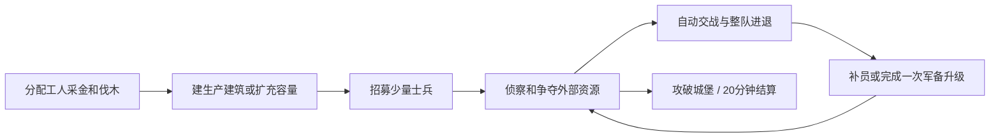

# 小小国家 RTS 游戏设计

版本：0.1 · 2026-09-22 · 状态：基于现有素材的首版策划，数值待对局验证。

## 1. 设计结论

《小小国家》采用**每方约20人、采集建设、容易操作**的轻量传统 RTS：派工人采金伐木，选择先扩军还是先补经济，以战士掩护弓箭手争夺外部资源，最后攻破敌方城堡。每个士兵都是独立选择和控制的单位，没有一个图标对应几十人的隐藏编制。

用户已明确的约束：

- 使用当前项目已经拥有的素材，不依赖新增兵种美术、建筑美术或动画。
- 正常完整对局目标 15–20 分钟。
- 初步 Demo 支持 2 人联机测试，最终最多 4 人。
- 采用采集、建造、出兵的轻量传统 RTS。
- 精炼的是**同屏参战数量**，不是单纯减少兵种种类。
- 每方单位约20人，目的是降低上手与操作难度，而不是做必须频繁微操的少数精英单位游戏。

本稿作出的策划选择：

- Demo 为 1v1，共用一套兵种和数值，蓝红区分玩家；完成版优先扩展为 2v2，新增紫黄玩家色。四种颜色不是四个不同种族。
- 每人使用统一人口池：城堡起始容量10，住宅逐步扩充到本稿目标20；工人和所有士兵均占1人口，**不设置各兵种人数上限或固定配额**。玩家可选择更多工人、更大军队或不同兵种比例。
- “6工人+14军人”等只是测算示例。1v1全图最多40个可控单位，2v2沿用每人20人口、全图最多80个可控单位；战斗人数由玩家的实际配兵决定。必须测试全军人集中交战，不能靠“建议分路”假定这个场景不存在。具体口径见[数值表](Balance.md)。
- Demo 使用工人、战士、弓箭手；完整小阵容增加长枪兵和修士。已有其他生物暂不编成新种族或野怪系统。
- 只有金币、木材两种资源；住宅提供共享人口容量。没有食物消耗、英雄、装备、随机暴击、局外成长和多时代科技树。
- 建造采用地图预设地块，保留建筑投资与位置选择，同时避免首版自由堵路、动态改道的额外规则。

## 2. 玩家一局做什么

主要操作为左键选取、右键下令：工人自动完成采集往返，士兵右键地面默认边走边接敌，建筑支持连续加入生产队列。无需逐人点敌、逐次收菜或手动释放技能，少量快捷键只提升效率，不是通关教学的前提。

核心取舍是：有限人口里用多少工人、前排和远程；全军继续压制还是撤回休整；资源投入补员、升级还是前线仓库。精细拉扯和集火可以带来优势，但入门玩家用整队进退也应能完成对局。

希望一名健康战士在单挑中能存活约20秒，被少数单位集火时有数秒反应机会。完整军队集中攻击仍可快速击杀，不能宣称每次被集火都保证撤退成功。全军回城休整能保存兵力，但会让出地图资源。

## 3. 文档导航与唯一来源

| 文档 | 内容 |
| --- | --- |
| [素材约束与现状清单](AssetScope.md) | 每类玩法对应的真实素材路径；已装配和未装配的区别；明确不启用的内容 |
| [规则、地图与对局流程](RulesAndFlow.md) | 胜负、采集、建造、生产、地图、房间、2v2和界面 |
| [单位逻辑与战斗合同](UnitsAndCombat.md) | 命令优先级、索敌追击、命中、远程、工人、盾防、治疗和死亡 |
| [初版数值与推算](Balance.md) | 全部设计参数的权威表；经济预算、击杀时间、攻城时间和调整顺序 |
| [Demo范围与验收](DemoPlan.md) | 当前实现缺口、按依赖推进的阶段、测试记录和验收口径 |

`Balance.md` 保存设计数值，其他文档描述规则或解释引用；当前 `.asset` 配置只代表技术原型，不代表这份平衡方案。发生冲突时应修订文档版本并共同复核，不可把两组数值混用。

## 4. 阅读边界

这次交付只新增策划文档和文档入口，没有修改现有代码、Prefab、Animator、地图和单位数值，也没有实施联网。文档中的“应当”“规则”“上限”均为拟实现目标。

素材与实现现状来自 2026-09-22 工作区静态检查，包含尚未提交的现有改动；文档不把它们当作已通过运行验收的产品能力。数值计算是纸面模型，不能证明实际胜率、操作手感或平均对局时长。

15–20 分钟指正常完整对局的体验目标。投降、掉线判负、明显失误导致的速攻可以提前结束；不以城堡无敌期强迫玩家等待到第 15 分钟。20 分钟为有效游戏时间的结算上限，加载、准备和掉线暂停不计入。

后续制作单位继续遵循[Unit 制作规范](../UnitPrefabAuthoring.md)，场景继续遵循[World 放置规范](../../GameAsset/World/WorldPlacementGuide.md)。本稿提出的玩法能力不等于修改上述技术规范，也不授权提前改写正在开发的 AI。
