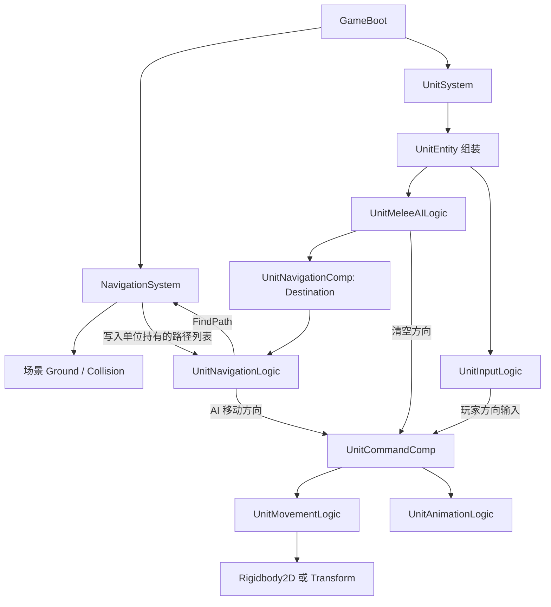
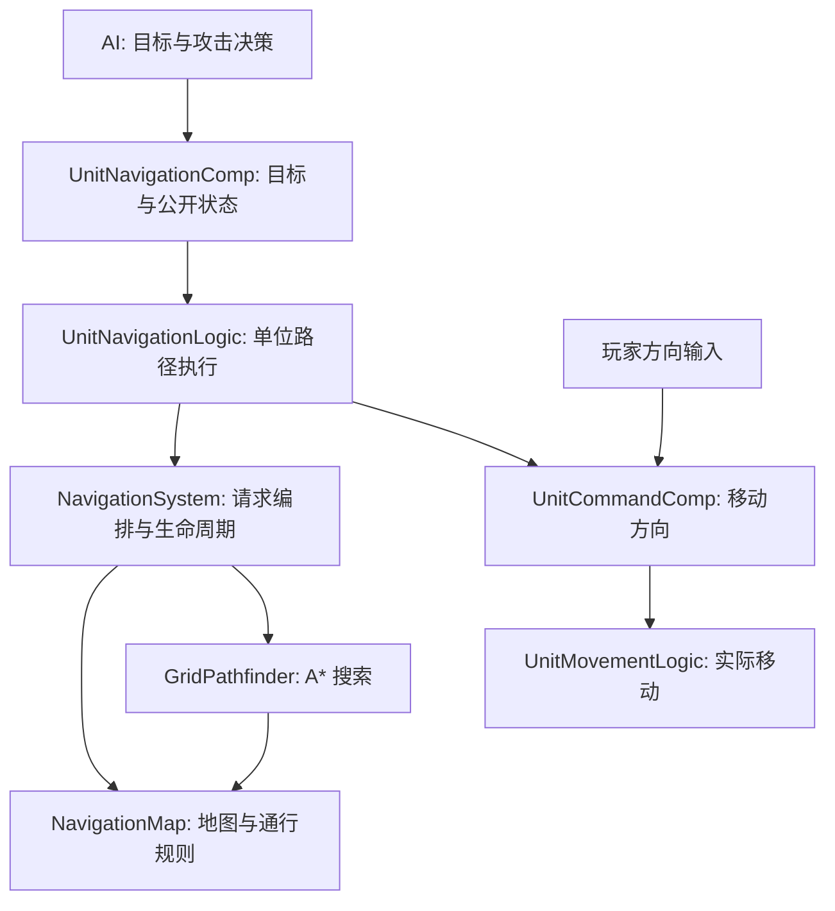

# 导航系统架构审查与最小整理方案

> 审查日期：2026-09-21。依据当前工作区，包括尚未提交的导航、AI 和单位代码。
> 原始审查只分析源码，没有运行 Unity。文档方案已于 2026-09-21 实施，结果见第 10 节。
> 第 3、4 节保留实施前证据，便于理解本次修改解决了什么问题。

## 1. 结论

现有技术方向适合当前阶段：**静态 Tilemap、八方向 A*、单位路径跟随、独立移动执行**。没有必要为了“优雅”更换导航技术或建立完整 RTS 导航框架。

现在最需要整理的是两件事：

1. **行为契约没有闭环。** 目标存在、找到路径、走完路径、到达目标、无法继续，这些状态没有明确分开，重试和卡住处理因此互相干扰。
2. **共享服务内部混合了不同的变化原因。** 场景绑定、地图规则、碰撞净空、A* 搜索、路径输出都放在 `NavigationSystem`，修改其中一项需要理解整个类。

建议先明确结果、状态和所有权，再把共享服务收敛为 **NavigationSystem + NavigationMap + GridPathfinder**。单位端保留现有 `UnitNavigationLogic` 和 `UnitMovementLogic`，不再拆一串策略、管理器和接口。

目标是让每个问题有唯一归属：

| 问题 | 负责者 |
| --- | --- |
| 追谁、什么时候停止追击并攻击？ | `UnitMeleeAILogic` 与技能范围判断 |
| 地图哪里允许通过？ | `NavigationMap`，建议新增 |
| 怎样从起点搜索到终点？ | `GridPathfinder`，建议新增 |
| 一次路径请求怎样转换、校验并返回？ | `NavigationSystem` |
| 当前单位沿哪一段走、什么时候重规划？ | `UnitNavigationLogic` |
| 移动速度是多少、怎样改变实际位置？ | `UnitMovementLogic` |

## 2. 当前范围与应保留的设计

当前实际链路是近战 AI 追敌；玩家使用方向输入直接移动。没有已接入的玩家点击寻路、编队或 Attack-Move。

当前地图规则是 Ground 有 Tile 且 Collision 无 Tile的格子可以参与寻路；Collision 上半格、斜边 Tile 仍按整格排除，再通过碰撞轮廓净空作进一步限制。这是保守的整格导航模型，并不支持在被标记阻挡的半格内寻找通道。

应保留：

- 导航属于 `GameLogic.Navigation`，不下沉到 `BorFramework`。
- `GameBoot` 创建服务并通过构造函数传递依赖。
- AI 决定目标，导航输出移动方向，Movement 执行移动。
- 路径列表由每个单位自己拥有，公共寻路服务只复用搜索临时集合。
- 半径净空、禁止斜穿角、起点接入检查、路径点越过检测都有实际用途，不能为了精简直接删除。
- `Stop/Dispose` 取消场景订阅、清空路径；单位回收前释放 Entity，重新生成时重建运行时状态。
- 当前单位身体碰撞互相忽略，不要引入硬占格来“修正”拥挤。

当前不做：动态建筑占格、障碍更新系统、局部避让、软分离、编队、流场、多线程寻路、请求调度器、联网确定性、通用行为树。

## 3. 当前调用链与状态位置



输入与 AI 是构造时互斥的两条分支，不是当前同一单位上的并行控制器。

`EntityModule` 在 Update 中逐个更新 Entity，每个 Entity 内按 `ELogicPhase` 排序：Input → Command → Navigation → Movement → Combat → Presentation。这个顺序只保证**单个单位内部**阶段有序，并不是全场所有单位先一起决策、再一起移动。

| 当前位置 | 保存内容 | 判断 |
| --- | --- | --- |
| `NavigationSystem` | 场景引用、可行走格、A* 开闭集合和格路径 | 地图状态和搜索临时状态应该分开 |
| `UnitNavigationComp` | `HasDestination`、`Destination` | 能表达目标，不能表达执行结果 |
| `UnitNavigationLogic` | 路径、索引、已规划目标、重规划与卡住计时 | 单位私有执行状态放在 Logic 内是合理的 |
| `UnitCommandComp` | 当前移动方向 | 是移动输出，不是完整的业务命令队列 |
| `UnitEntity` | 组装时计算导航锚点和圆形半径 | 组装职责中混入了碰撞体适配规则 |

不建议为了“数据和逻辑分离”把所有路径缓存、计时器搬到 Component。只有其他逻辑确实需要读取的目标、状态和失败原因才需要公开。

## 4. 审查发现

这里的 P1 表示当前行为闭环应先处理，P2 表示职责与边界整理；不是对线上事故严重程度的评级。行号基于本次工作区快照，后续以方法名定位。

### 4.1 P1：路径耗尽没有终态，可能不断重新规划

**证据：** `UnitNavigationLogic.cs:85–89、107–124`，`UnitNavigationComp.cs:8–22`。

路径点走完只清空方向，没有到达状态；下一帧 `NeedsRepath()` 看到索引已到末尾就返回 true，而且该分支在重规划冷却检查之前。只要目标没有被 AI 清除，就会再次请求路径。

此外，`NavigationSystem.AddDestinationWaypoint()` 总是先添加目标格中心，再尝试添加精确终点。同格情况下也走这个流程。单位已经站在一个非格中心的精确目标上时，再次规划仍可能得到“格中心 → 原目标”的路径，产生无意义的回走。

这是源码可推导的行为；AI 在攻击范围内会先清除目标，所以并非每次追击都触发。触发条件是目标仍有效且路径已经耗尽，或在同格内反复规划。

**建议：** 到达必须是稳定状态；路径耗尽后检查请求终点，而不是无条件再次寻路。同格且当前位置已经满足到达容差时直接完成；同格且直达安全时直接输出目标。真实目标未到但路径耗尽才进入受控恢复流程。

### 4.2 P1：返回成功不一定代表能到请求目标

**证据：** `NavigationSystem.cs:296–319`，`INavigationSystem.cs:9–20`。

当目标格中心到精确目标的净空检查失败，`AddDestinationWaypoint()` 保留格中心并省略请求目标，外层仍可能返回 true。调用者只能看到成功和路径，无法区分精确到达与退到格中心。

反过来，目标在被标为阻挡的格子内时会直接失败，并没有“寻找附近最近可达点”的实现。当前行为不能统称为完整的目标投影或部分路径能力。

**影响：** AI 仍可能认为需要继续追击，导航却只能重复走到同一个格中心；上层难以判断是目标不可达还是尚未完成。

**建议：** 当前阶段选最简单的严格契约：成功路径必须结束于请求目标，不能做到就明确失败。不要悄悄替换终点。将来确实需要接近不可达目标时，再增加 `Partial` 和实际终点，而不是现在搭建通用目标投影系统。

### 4.3 P1：卡住检测在“没有路径、没有移动意图”时也工作

**证据：** `UnitNavigationLogic.cs:73–80、107–145、169–191`。

寻路失败后仍初始化进度样本；后续 Tick 在判断重试冷却之前调用 `IsStuck()`。若单位静止约 0.4 秒，会把 `_hasPlannedDestination` 设为 false，绕过原本 0.5 秒的失败重试等待。具体触发帧取决于 dt，但两套计时互相覆盖可直接从控制流确认。

检测依据还是“离上次样本位置移动了多少”，并不代表向路径目标取得进展。被挤走或来回摆动可能被算作进步；暂停前留下的样本也没有在恢复时重新建立。

**建议：** 只在 Following、有未完成路径点、允许移动且上一轮确实输出移动意图时检测卡住；暂停或退出 Following 时清除样本。先使用到当前路径点的距离改善作为进度指标，切换路径点时重置。失败等待不能参与卡住检测。

### 4.4 P2：NavigationSystem 同时拥有五类职责

**证据：** `NavigationSystem.cs:43–65、138–170、172–269、271–356、359–420`。

同一个类同时处理场景生命周期、地图提取、净空几何规则、A* 搜索和路径输出。问题不在约 500 行的长度，而是五类不同需求都要改它。

**建议：** 提取地图能力和搜索算法，保留 System 做生命周期与一次请求的编排。路径压缩、起终点接入暂时继续作为 System 的私有方法，不立即再拆 `PathBuilder`、`PathSmoother` 等类。

### 4.5 P2：导航失败对上层不可见，AI 同时越过边界清空移动输出

**证据：** `UnitMeleeAILogic.cs:47–75、134–139`，`UnitNavigationComp.cs`。

AI 每帧刷新目标位置，但读不到到达、无路径或阻塞结果；它既清导航目标，又直接清 `UnitCommandComp`。当前阶段顺序使它通常能工作，但停止职责有两个写入者。

**建议：** AI 只设置/取消导航目标并读取状态，AI 单位的移动方向只由 `UnitNavigationLogic` 写入；Movement 保留生命和技能限制作为最终执行保护。玩家控制仍由 `UnitInputLogic` 写方向，不强行接入导航或增加控制权仲裁系统。

导航层和移动层都检查 `BlocksMovement` 并不天然是错误：前者暂停跟随及计时，后者保证实际速度停止。需要明确两者目的，而不是机械删除其中一个。

### 4.6 P2：场景发现、地图有效性和单位几何的前提不显式

**证据：** `NavigationSystem.cs:11–12、138–169、393–420`，`UnitEntity.cs:126–137`。

- 地图依赖固定层级名称；缺 Ground 或 Collision 时静默不可用。
- 每次 `sceneLoaded` 都先清除现有地图，不区分加载的是不是导航所属场景；没有 `sceneUnloaded` 的对称处理。附加加载非地图场景会替换掉当前地图，是条件性风险，不是已复现的当前故障。
- 缺少地形 Collider 时净空函数直接返回 true；半径为零时也会跳过这些检查。
- 圆形实体半径和偏移在构造时计算，非圆形 Collider 默认得到零半径；实现没有通用体积支持。

**建议：** 显式限定单张静态地图、矩形格、共享 Grid 坐标、固定根节点缩放和旋转。需要圆形净空时，缺 Collider 应标记地图不可用并给一次定位日志。无身体碰撞体的点单位可以保留，但必须是明确支持的模式；有实体碰撞体却是不支持的形状不能静默当作点。

本次检查的 WarriorBlue 与 Spider Prefab 使用圆形身体碰撞体；这不能推导成所有单位都拥有相同物理配置。

### 4.7 P2：跳过路径点的条件只约束前后，不约束横向偏离

**证据：** `UnitNavigationLogic.cs:149–166`。

点积判定只说明单位越过了路径点所在的垂直分界线。单位从侧面远处越过该线时，也会跳过路径点；下一段从当前位置出发是否安全并未重新校验。

**建议：** 保留越点处理以避免高速错过小容差，但增加有限的横向偏离条件；明显离开原路径段时走重规划分支。这个风险需要通过侧向推移、转角与高速度场景复现，不能仅凭静态审查宣称已经出现穿墙。

### 4.8 范围限制：静态地形导航与世界物件物理阻挡尚未统一

**证据：** `NavigationSystem.cs:160–168、412–420`；[World 资源规范](../GameAsset/World/WorldPlacementGuide.md) 的“障碍物与碰撞”。

寻路只读取 Collision Tilemap 及其 Collider；单独放在 WorldObjects 下的 Obstacle Prefab 不会自动进入导航。物理会挡住但导航看不见时，重复寻路可能始终返回相同路径。

这是现有文档已经声明的初版限制，不应借本次整理扩展动态占格。当前若有永久物件需要可靠绕行，应在地图制作时同步用 Collision 表达阻挡，或暂不把独立 Collider 当作可寻路障碍使用。

## 5. 建议架构：三个共享类型，两个单位行为



### 5.1 NavigationSystem：共享服务边界

拥有地图实例和搜索器；负责绑定/清理地图、检查可用性、接收请求、调用搜索器、构建路径点、校验起终点并返回结果。

它不保存各单位当前目标、路径索引、重规划倒计时，不认识队伍、敌人、攻击距离和技能。保留现有 `INavigationSystem` 作为 Units 的依赖边界，不给每个内部类配套接口。

第一步可以继续把固定路径查找保留在 System 内，让地图对象通过显式 Tilemap/Collider 引用构造。无需为了两个引用马上增加场景注册框架。地图制作规模增加时，再考虑一个仅保存序列化引用的场景入口。

### 5.2 NavigationMap：唯一的静态通行规则拥有者

负责可行走格集合、格子与世界坐标转换、圆形净空、格间通行、对角限制和路径段检查。它可以依赖 Unity Tilemap 与 Collider2D，当前没有脱离 Unity 的运行需求。

建议提供少量具体操作：`IsWalkable`、`CanTraverse`、`HasSegmentClearance`、`WorldToCell`、`GetCellCenterWorld`。这些操作应复用同一套净空规则，不能让 A*、路径输出各自维护一套阻挡判断。

地图内容在绑定后视为静态；运行时修改 Tile 不属于当前合同。地图中缺少必要引用是一种配置错误，不应被解释为“到处可走”。

### 5.3 GridPathfinder：仅负责格路径搜索

接收地图、起终点格、单位半径，输出格路径。拥有 open/closed 集合、节点记录、父节点回溯与搜索缓存。

它不订阅场景事件，不读取 Unit，不输出速度，不做攻击接近策略。继续使用当前八方向 A* 和 10/14 代价，先保留线性 open list；没有性能证据前不更换堆、不增加缓存矩阵或异步队列。

这是与场景生命周期解耦，不是要求“完全不依赖 Unity 类型”的跨引擎算法库。

### 5.4 UnitNavigationLogic：单个单位的执行器

拥有路径列表、索引、已规划目标、执行计时和恢复次数；根据公开目标和执行状态输出移动方向。

它不做 A*，不决定追哪个敌人，不判断攻击范围，不直接设置 Rigidbody 速度。到达、失败、暂停、卡住都在这里形成可读的状态转移。

`UnitNavigationComp` 只保留目标和外部需要读取的状态/原因。内部列表不暴露给 AI，不把全套内部字段搬进组件。

### 5.5 UnitMovementLogic：移动的最终执行边界

读取方向和 MoveSpeed，应用生命/技能限制，通过 Rigidbody2D 或已有 Transform 分支移动；保留停止时清速度的职责。

不要把净空采样、重新寻路或攻击距离塞进这里。实体碰撞体到导航参数的提取可收拢为 `UnitPhysicsComp` 的具体方法/属性，由 Entity 组装时传入；不需要新建通用形状适配器体系。

当前 Rigidbody 速度是在 Entity 的 Update 链路中赋值，`ELogicPhase.Movement` 不等于 FixedUpdate。后续如实测出现物理时序抖动，再单独评估“Update 生成意图、FixedUpdate 消费意图”；不能在这次职责提取中顺便重排整个框架。

## 6. 先固定的接口与状态合同

### 6.1 一次路径查询的合同

保持现有接口参数形态即可，不急于引入请求对象。建议用一个小枚举表达查询结果，例如 `EPathQueryStatus`：

| 结果 | 含义 | 输出列表 |
| --- | --- | --- |
| `Success` | 从实际起点可连接到请求终点 | 非空，最后一点是请求终点 |
| `MapUnavailable` | 当前没有可用地图或必要几何数据 | 空 |
| `InvalidStart` | 起点格、起点位置或起点接入不成立 | 空 |
| `InvalidDestination` | 目标格、精确目标或目标接入不成立 | 空 |
| `NoPath` | 起终点有效但搜索不连通 | 空 |

若改为返回枚举，方法可命名为 `FindPath`；若保留 `TryFindPath`，仍返回 bool，并以 out 给出失败原因。选择其中一种，不同时维护两套等价 API。

坐标与所有权必须写进接口注释：

- 对外起点、目标和路径点统一是 **Unit 根节点世界坐标**，沿用当前调用方式。
- System 边界用 `rootPosition + navigationAnchorOffset` 转成碰撞中心，再把结果减去 offset 返回。Map 与 Pathfinder 内部只处理碰撞中心及格坐标。
- 半径是世界单位长度；当前只覆盖固定形状/缩放的圆或显式点单位。
- 输出 List 归调用者所有；每次请求先清空，失败必须为空；服务不保留调用者列表引用。
- 当前只在主线程同步、串行调用，共享搜索缓存不支持并发/重入。未来异步化必须重新设计所有权。
- 现有 `0.05` 间隔采样是近似净空检查，不宣称为任意几何的连续碰撞证明。先保留并验证拐角；是否换扫掠查询应另立有证据的修复。

### 6.2 单位执行状态

建议增加一个简单枚举 `EUnitNavigationState`，不引入状态机框架：

| 状态 | 进入条件 | 输出与离开条件 |
| --- | --- | --- |
| `Idle` | 无目标、主动取消、死亡或停止 | 零方向，清路径和计时 |
| `Following` | 已获得路径且尚未到达 | 跟随、检测进度，必要时重规划 |
| `Paused` | 技能暂时禁止移动 | 零方向，保留请求，停止进度计时；恢复时重置样本 |
| `Arrived` | 实际位置满足本次目标的到达容差 | 零方向；同一未变化目标保持此状态 |
| `Blocked` | 查询失败或有限恢复仍无进展 | 零方向，记录失败原因；不每帧重试 |

这是建议设计，不代表现有代码已经有这些状态。暂停前的终态需要保留，恢复不能把 Arrived/Blocked 无条件变回 Following。

区分三个概念：

- `WaypointReachedDistance` 是中间路径点的跟随容差。
- `ArrivalDistance` 是本次导航请求的完成容差，两者可先使用同一个数值，但语义分开。
- 攻击范围由 `MeleeAttackSkill.IsTargetInRange()` 判断。当前是实际技能查询，不应替换成导航中的通用停止半径。

同目标位置的重复写入必须幂等，尤其不能把每帧 `SetDestination` 都当成新任务、重置 Blocked 或 Arrived。AI 换目标时可显式开始新请求；追同一目标时仅更新位置。只有目标发生有意义变化、地图重新绑定或上层显式重试才重新开启终态请求。

### 6.3 重规划与失败策略

先采用一个可理解的最小策略，再根据手感调整阈值：

1. 新请求立即规划；追踪同一目标时，沿用当前“位移阈值 + 最短重规划间隔”的节流。
2. Following 无进展时允许一次恢复规划；新路径仍不能前进则进入 Blocked。恢复预算只有实际取得进度或开始新请求时重置，不能在每次算出路径后重置。
3. 明确不可达、目标无效时直接 Blocked，不对静态地图无限定时重试。若保留临时失败重试，只能有一个计时入口，且不能被卡住检测绕过。
4. 正常消耗完路径且接近目标，进入 Arrived；消耗完但偏离目标，按恢复预算处理。
5. AI 收到 Blocked 后，当前可先停住等待目标明显移动或新指令。自动换敌、追击上限和放弃规则是 AI 行为合同，另行确定，不由导航擅自决定。

这里“一次恢复”是初版建议值，目的在于终止同一路径的无限循环，不是已经实测最优的参数。

### 6.4 生命周期和地图所有权

- System 拥有唯一当前地图及其所属 Scene；单位拥有自己的请求和路径。
- 绑定必须是完整成功或明确不可用，不能保留半套地图数据。
- 当前单场景流程可继续使用场景事件；若支持附加加载，应只替换真正的地图场景，卸载时仅清理所属地图。
- 单位随玩法退出释放时，依靠现有 Entity 销毁清理路径；若未来跨地图保留单位，再引入地图版本和旧路径失效机制。当前无需提前加版本广播系统。
- 缺场景引用等配置错误在绑定边界记录一次；不可达等普通业务结果走状态，不每帧输出日志。

## 7. 文件整理与实施顺序

建议目录保持扁平，暂不增加多层文件夹：

```text
Assets/Scripts/GameLogic/Navigation/
    INavigationSystem.cs          保留单位访问边界
    NavigationSystem.cs           保留，收敛为生命周期与请求编排
    NavigationMap.cs              新增，地图与净空
    GridPathfinder.cs             新增，A* 与搜索缓存
    EPathQueryStatus.cs            采用结果枚举时新增

Assets/Scripts/GameLogic/Units/Entities/Components/
    UnitNavigationComp.cs         目标与可观察状态
    EUnitNavigationState.cs       最小执行状态
    EUnitNavigationBlockReason.cs 阻塞原因
    UnitCommandComp.cs            保留当前名字与移动输出用途
    UnitPhysicsComp.cs            收拢现有碰撞体参数提取

Assets/Scripts/GameLogic/Units/Entities/Logic/
    UnitNavigationLogic.cs        状态、跟随、恢复
    UnitMovementLogic.cs          实际移动
    UnitMeleeAILogic.cs           目标与攻击决策
```

`NodeRecord` 很小且只用于 A*，可继续作为 Pathfinder 的私有嵌套类型，符合通用 C# 规范；不为了文件数量好看而拆分。导航专属状态枚举在 Units 下，因为共享服务不应该认识单位执行状态。

| 阶段 | 修改范围 | 完成标准 |
| --- | --- | --- |
| 1. 固定行为 | 确认严格终点、到达终态、暂停、Blocked 和恢复规则 | 上层能区分成功到达与失败，不再无限重规划 |
| 2. 修正闭环 | NavigationSystem 的结果合同、Comp 状态、NavigationLogic 状态转移、AI 单一输出边界 | 修复 4.1–4.3；同目标重复写入不重启请求 |
| 3. 提取职责 | 从 System 提取 Map 和 Pathfinder | 继续使用原算法、邻居顺序、代价、净空参数和路径压缩；不夹带算法升级 |
| 4. 收拢适配 | 几何参数提取、场景失败日志、必要的地图归属处理 | 配置错误可定位，单位与地图前提明确 |
| 5. 聚焦验收 | 下表中的路径与战斗场景 | 按当前运行结果验收，再决定是否需要性能或物理优化 |

阶段 2 是行为修正，阶段 3 是结构提取，应该分开验证，避免一次改动后无法判断行为差异来自哪里。全过程不修改第三方、不批量重命名、不顺手重构框架更新链路。

## 8. 后续实施的验收清单

本次没有执行下面的运行验收；这些是实施后的检查条件。优先观察受影响行为，不需要先搭大型测试框架。

| 场景 | 预期结果 |
| --- | --- |
| 空地绕障碍、斜向拐角 | 不切角，圆形单位保持净空，起点到第一路径点可连接 |
| 起点与目标同格，目标不是格中心 | 能安全直达时不先绕格中心 |
| 已在目标上且继续重复写入同目标 | 保持 Arrived，不回走、不继续调用 A* |
| 目标格可行走，但精确目标贴墙不满足净空 | 明确 InvalidDestination，不以格中心冒充成功 |
| 起终点都有效但被墙隔开 | NoPath → Blocked，不因 0.4 秒卡住检测提前重试 |
| 跟随中实际无法前进 | 有限恢复后 Blocked，不无限重复相同路径 |
| 释放或结束阻止移动的技能 | 暂停期间无卡住计时，恢复后重新采样进度 |
| 路径点附近高速度越过、侧向偏离 | 正常越点不震荡，偏离明显时不盲目跳到下一段 |
| 移动目标持续小幅或大幅位移 | 重规划按阈值节流；终态在有意义目标变化后重新启动 |
| 近战进入攻击范围、攻击冷却中 | AI 取消导航并在范围内等待，不因冷却继续往目标内挤 |
| 缺 Ground、Collision 或必要地形 Collider | 明确不可用并记录一次可定位信息 |
| 死亡、回池、再次生成、退出并重进 Demo | 无旧路径、旧速度、进度计时与场景引用残留 |

可在开发时临时记录路径请求次数、触发原因和执行状态，用于确认“到达后零请求”“失败不忙重试”。不必因此先开发调试窗口。

## 9. 证据索引与审查边界

以下链接均相对本文件，适用于仓库内阅读；具体行号见第 4 节。

| 来源 | 本次确认内容 |
| --- | --- |
| [NavigationSystem](../Scripts/GameLogic/Navigation/NavigationSystem.cs) | 场景绑定、查询编排、严格起终点和世界路径输出 |
| [NavigationMap](../Scripts/GameLogic/Navigation/NavigationMap.cs) | 静态格、圆形净空、对角限制与线段通行规则 |
| [GridPathfinder](../Scripts/GameLogic/Navigation/GridPathfinder.cs) | 八方向 A*、开闭集合、节点记录与格路径回溯 |
| [INavigationSystem](../Scripts/GameLogic/Navigation/INavigationSystem.cs) | 查询接口与结果形态 |
| [UnitNavigationLogic](../Scripts/GameLogic/Units/Entities/Logic/UnitNavigationLogic.cs) | 路径跟随、重规划、越点、卡住检测 |
| [UnitNavigationComp](../Scripts/GameLogic/Units/Entities/Components/UnitNavigationComp.cs) | 目标状态 |
| [UnitMeleeAILogic](../Scripts/GameLogic/Units/Entities/Logic/UnitMeleeAILogic.cs) | 索敌、目标更新、范围内停止及技能触发 |
| [UnitInputLogic](../Scripts/GameLogic/Units/Entities/Logic/UnitInputLogic.cs) | 玩家方向输入分支 |
| [UnitMovementLogic](../Scripts/GameLogic/Units/Entities/Logic/UnitMovementLogic.cs) | 速度与位置执行、停止保护 |
| [UnitEntity](../Scripts/GameLogic/Units/Entities/UnitEntity.cs) | 输入/AI 互斥组装与导航几何参数 |
| [UnitSystem](../Scripts/GameLogic/Units/Systems/UnitSystem.cs) | 单位生成回收和身体碰撞互相忽略 |
| [MeleeAttackSkill](../Scripts/GameLogic/Units/Skills/Runtime/MeleeAttackSkill.cs) | 攻击范围由技能实际查询决定 |
| [Entity](../Scripts/BorFramework/1_Core/ELC/Entity/Entity.cs)、[EntityModule](../Scripts/BorFramework/2_Module/EntityModule/EntityModule.cs) | 每个实体内阶段排序与 Update 驱动 |
| [GameBoot](../Scripts/GameLogic/GameBoot.cs) | 导航与单位系统依赖注入和注册顺序 |
| [World 资源规范](../GameAsset/World/WorldPlacementGuide.md) | 静态阻挡来源及初版范围限制 |
| [C# 规范](CodingStandards.md)、[目录规范](DirectoryStandards.md) | 责任、生命周期、简单设计和放置规则 |

审查依据是当前源码和配置静态证据。未做性能测量、物理碰撞运行验证或场景视觉验收；不据此宣称运行稳定，也没有必要凭猜测把初版 A* 换成更复杂的系统。

## 10. 实施结果

2026-09-21 已按第 7 节顺序完成运行时代码整理：

- `FindPath` 返回 `EPathQueryStatus`；失败输出为空，`Success` 的最后一个路径点始终是请求终点。
- 同格直达安全时直接输出精确终点，不再先绕到格中心；精确终点不能安全接入时返回
  `InvalidDestination`。
- `UnitNavigationComp` 公开请求版本、执行状态、最近查询结果和阻塞原因；同请求的位置刷新不会重置终态。
- `UnitNavigationLogic` 使用 `Idle / Following / Paused / Arrived / Blocked`，只在 Following 且上一轮输出过移动意图时检测进度。
- 卡住或路径提前耗尽只允许一次恢复规划；普通查询失败直接进入 Blocked，不再由两套计时器无限重试。
- AI 只开始、更新或取消导航目标，不再直接写 AI 单位的移动方向。
- `NavigationMap` 成为静态地图和净空规则的唯一拥有者；`GridPathfinder` 只保留原八方向 A*。
- 场景绑定改为完整成功后再替换当前地图，并按所属 Scene 卸载；缺 Tilemap、Collider 或可行走格时记录一次定位日志。
- 圆形单位的导航偏移和世界半径由 `UnitPhysicsComp` 提取；无碰撞体仍是显式点单位，不支持的实体碰撞形状会报错并不创建 AI 导航。

本次没有修改场景、Prefab、技能配置、物理更新阶段或动态障碍范围，也没有处理第 4.7 节尚需运行复现的横向越点风险。
未运行 Unity、编译或 Play Mode；第 8 节的运行验收仍由实际 Demo 测试确认。
