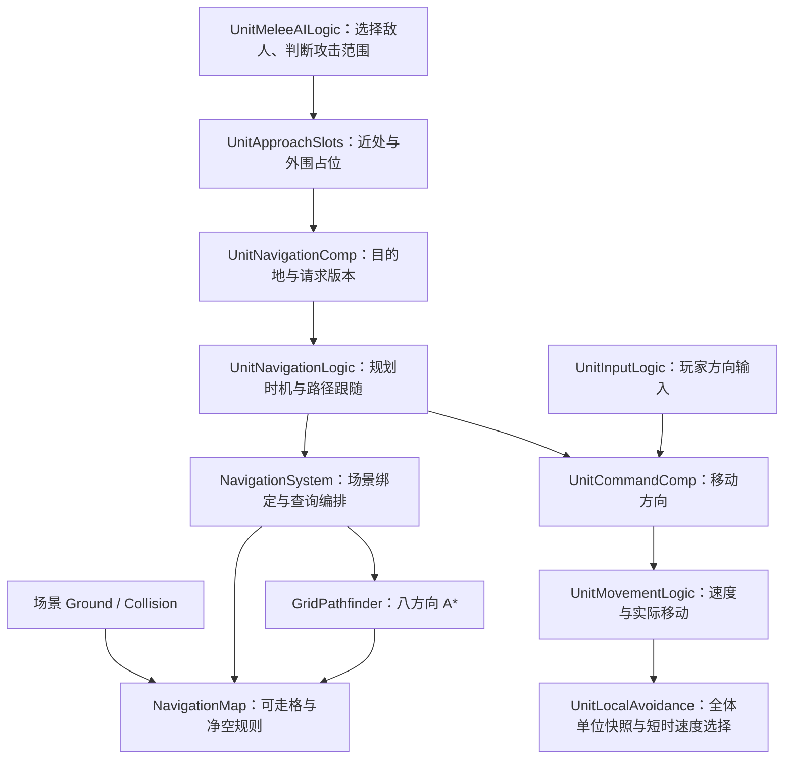

# 导航系统职责与执行流程

更新日期：2026-09-26。本文描述当前场景 Tilemap 导航与单位执行合同。
本次仅完成源码与调用链检查；未运行 Unity 编译、Play Mode、物理验收或性能测试。

## 1. 从哪里开始读

当前导航用于近战 AI 追击，玩家仍通过方向输入直接移动。职责按下面的顺序阅读：



- **AI 决定去哪里。** 进入技能攻击范围后取消导航，再尝试攻击；冷却中仍在范围内等待。追同一目标的单位通过 UnitApproachSlots 获得稳定的近处或外围目的地；近处没有空位时在外围等候，空位释放后再移动过去。
- **导航决定如何沿路径走。** 它不选敌人、不判断攻击范围、不直接改变 Rigidbody 速度。
- **Movement 执行移动。** 它同时服务玩家与 AI，保留死亡、技能禁止移动时的最终停止保护。
- **共享服务绑定场景地图并回答路径查询。** 它不保存各单位的目标、路径索引或重规划计时。

Demo 与 NavigationTest 场景加载后，由 `NavigationSceneSystems` 注册 NavigationSystem 和 UnitSystem；离开场景时按依赖逆序移除。UnitEntity 直接装配单位侧对象。每个实体内按 Command → Navigation → Movement 更新；这不是全场跨实体的阶段调度。UnitSystem 管理追击位置的占用与释放，并在 LateUpdate 收集全体单位的身体圆心与本帧期望速度，为正在寻路的单位统一计算局部避让速度，再写入 Rigidbody2D。玩家与静止单位参与邻居检测，但不由局部避让改变速度。

## 2. 场景地图的来源与生命周期

NavigationSystem 启动时检查当前活动场景，并订阅 `sceneLoaded` / `sceneUnloaded`。地图来自场景中的：

```text
World/Grid
    ├─ Ground       Tilemap
    └─ Collision    Tilemap + Collider2D
```

绑定时先定位一次 `World/Grid`，再读取 Ground 与 Collision。Collision 优先使用 CompositeCollider2D，其次使用其他 Collider2D。
菜单等没有地图的场景不会报告缺地图错误；地图只声明了一层、缺少必要组件或没有可走格时记录错误。

NavigationMap 在构造时读取 Ground 的 `cellBounds`，两层都用这一范围调用 `GetTilesBlock`，按相同索引遍历：
**Ground 有 Tile 且 Collision 没有 Tile 的格子才可走。** 可走格保存到 HashSet，格坐标 Z 归零；临时 Tile 数组不被地图长期保存。
Ground 范围为空时直接得到空地图。

候选地图完整且有可走格时才替换当前地图。Additive 场景绑定失败保留原地图；Single 场景没有可用地图时清空原地图。
持有地图的场景卸载，或系统 Stop / Dispose 时，清理地图与查询临时路径；再次 Start 会重新检查活动场景。

可走格在绑定时构建，**不会自动追踪运行中的 Tile 增删**。格中心坐标仍通过 Ground Tilemap 换算，净空仍查询 Collision 的碰撞体；因此当前实现要求地图保持静态。
地编直接维护 Ground 和 Collision，不需要额外维护一份导航配置。

Demo 加载或复用场景后直接生成玩家。场景加载或玩家生成失败时，当前有效进入流程记录错误并返回主菜单；每次异步结束检查进入版本，过期生成的单位会被回收。退出 Demo 时回收所持玩家单位，地图由 NavigationSystem 的场景事件管理。

## 3. 请求和执行结果

`UnitNavigationComp` 保存两组数据，写入责任分开：

| 数据 | 写入者 | 含义 |
| --- | --- | --- |
| HasDestination、Destination、RequestVersion | AI 通过 BeginDestination / UpdateDestination / ClearDestination | 希望执行的请求。 |
| State、LastPathQueryStatus、BlockReason | UnitNavigationLogic | 最近一次处理请求后的执行结果。 |

`BeginDestination` 开始新请求；`UpdateDestination` 只更新当前目标位置，没有当前请求时才开始新请求；
`ClearDestination` 取消请求。开始和取消增加版本，重复更新同一请求不增加版本。

**修改请求不会立即重置执行结果。** NavigationLogic 在下一个 Navigation Tick 消费请求，统一清理旧路径、状态和计时。
当前 AI 位于更早的 Command 阶段，因此请求通常在同一实体的当帧更新中生效。其他代码不应在刚写入请求时把旧 State 当作新请求结果。

状态和阻塞原因通过 `SetExecutionState` 一起更新；进入 Idle 时清除最近查询结果。
路径列表、索引、已规划终点、进度样本和恢复次数仍由 NavigationLogic 私有持有。

## 4. 单位每帧的执行顺序

`UnitNavigationLogic.OnTick` 保持一条主流程：

1. 清空本帧移动方向；死亡、对象失效或没有目的地时进入 Idle 并结束。
2. 请求版本变化时，清理旧执行状态并开始处理新请求。
3. 技能禁止移动时进入 Paused；恢复时还原暂停前状态和阻塞原因。
4. `NeedsPath` 判断是否需要规划，统一调用 `BuildPath`。
5. 只有 Following 状态继续跟随，产生本帧移动方向。

`BuildPath` 先判断是否已在到达距离内，否则执行路径查询，再记录 Following 或 Blocked；流程不用同一个 bool 同时表达到达和失败。OnStop 清理路径、执行结果和移动方向。

| 状态 | 何时规划 / 输出 |
| --- | --- |
| Idle | 有目的地时立即规划；无目的地时保持零方向。 |
| Following | 目标相对已规划位置移动至少 0.5 世界单位，且 0.25 秒重规划间隔已到时重算；否则继续当前路径。 |
| Paused | 保留请求，输出零方向并重置进度样本；暂停期间不消耗重规划或卡住计时。 |
| Arrived | 输出零方向；到精确终点后目标移动至少 0.5 世界单位、到附近停靠点后目标移动至少 0.1 世界单位，或开始新请求时重新规划。 |
| Blocked | 输出零方向；目标移动至少 0.1 世界单位或开始新请求时重新规划，不针对静态失败定时重试。 |

跟随时以 0.05 世界单位判断路径点到达和最终到达，也通过前进方向投影判断是否越过路径点。
只有上一帧确实输出移动方向、当前仍有路径点时才检查进度：距当前路径点改善至少 0.03 世界单位算取得进展，连续 0.4 秒无进展触发恢复。

路径提前耗尽和无进展共用一次恢复预算，原因分别为 PathEndedBeforeDestination、NoProgress。
恢复规划成功只重建进度样本，不立即补回恢复次数；新请求、目标显著变化或实际取得进展时重置预算。恢复用尽进入 Blocked。
清空的是当前命令，上一帧是否输出过方向仍用于进度检测。

暂停不会把 Blocked 或 Arrived 变成新任务。不可达敌人仍保持锁定等待，导航不会替 AI 改选敌人。

## 5. 一次共享路径查询

`INavigationSystem.FindPath` 是精确终点查询；`FindApproachPath` 专供当前追击链路使用。两者只在主线程同步串行调用。输出 List 归调用者持有，服务不保存其引用。

```text
单位 WordPos 世界坐标（缺失时用根节点）
    ↓ 加 navigationAnchorOffset
导航中心世界坐标
    ↓ NavigationMap 校验实际端点及其格中心
同格：优先直达；无法直达时尝试经本格中心
跨格：八方向 A* → 提取转角路点 → 终点接入检查 → 起点接入检查
    ↓ 成功后统一减 navigationAnchorOffset
单位 WordPos 世界路径；最后一点使用原始请求终点
```

追击先执行精确查询。仅当精确终点没有净空或找不到连通路径时，在目标格周围两格内按距离尝试可走格中心；对找到的格中心，在**同一格内**朝目标细化出更近且整段具有净空的停靠点。返回 `Approach` 时输出路径的最后一点是实际停靠点，另通过 `reachedDestination` 返回该点；它不表示已经到达原始目标。候选范围固定，全部失败则保留原始失败结果。AI 每帧仍用技能实际范围判断是否应该停止追击和攻击。

八方向 A* 保留原邻居顺序和平局选择，直走代价为 10，斜走为 14。候选代价无改善时提前跳过净空检查。
跨格路径压缩连续同方向的中间格，只保留转角；精确终点不在格中心时补上终点格中心，再连接请求位置。
实际起点能直达第一个路点时直接接入，否则尝试先连接起点格中心。

| 查询结果 | 含义 |
| --- | --- |
| Success | 输出非空路径，最后一点是请求终点。 |
| Approach | 只由追击查询返回；输出非空路径，最后一点是附近可到达的实际停靠点。 |
| InvalidRequest | 缺少输出列表。 |
| MapUnavailable | 当前没有绑定可用地图。 |
| InvalidStart | 起点格、实际位置、格中心或起点连接不满足通行要求。 |
| InvalidDestination | 目标格、实际位置、格中心或终点连接不满足通行要求。 |
| NoPath | 起终点通过基础检查，但没有可通行的格路径。 |

所有失败结果的输出路径为空，`reachedDestination` 为零。缺少输出列表时优先返回 InvalidRequest；输出列表有效但无地图时返回 MapUnavailable。
跨格请求先执行 A*，再检查终点与起点接入，因此多个问题同时存在时仍按该顺序返回结果。

## 6. 净空规则与当前限制

- Collision 有 Tile 的整格从可走集合排除，即使物理碰撞轮廓只覆盖半格；导航格判定比实际物理轮廓保守。
- 正半径通过 Collision 碰撞体的 `ClosestPoint` 检查净空，要求距离至少为单位世界半径加 0.02 世界单位。
  线段按最长 0.05 世界单位间隔采样，包含两端；这是采样检查，不是精确扫掠检测。
- 实际端点及本格中心都必须满足净空。斜向移动还要求相邻两个正交格可走，禁止直接斜穿阻挡角。
- 身体圆形碰撞体的世界半径与中心偏移由 UnitPhysicsComp 提取；无碰撞体为显式点单位，不支持的身体碰撞形状不能静默当作点单位。
  点单位保留格通行检查，但跳过 Collider 净空与线段采样。
- 地图外没有可走格；圆形身体对地图边缘的净空依赖 Collision 是否绘制了相应边界，不自动按 Ground 外轮廓生成边界碰撞。
- 不提供运行时 Tile 变更同步、动态障碍占格、编队、流场或异步请求调度。额外障碍 Prefab 不会自动加入地图。
- UnitLocalAvoidance 是短时预测与速度采样原型，不是完整 RVO/ORCA，也没有静态墙面约束或无重叠的数学保证。地图绕障仍由全局路径与物理碰撞处理；狭窄路口的人群可能等待。速度变化限制和保持原侧向用于减少左右抖动；局部让行时不把短暂的路径点无进展判成静态寻路失败。
- 单位独自追击目标时沿用原来的精确查询与附近停靠路径。多个单位追同一目标时，UnitApproachSlots 保留 2 个近处位置和两圈外围位置，每圈 12 个；位置须通过当前静态地图的路径查询。外围单位到位后等待近处位置释放；目标或单位离场时清理占位。所有位置不可达或已占满时单位暂时停止，而不是追到同一个精确点。这是当前近战追击与 20 单位测试的行为约定，不是编队系统。
- 玩家方向输入不经过导航，仍按实际物理移动规则执行。路径跟随使用固定世界距离容差；小格子、高速度、外力推挤和物理碰撞下的越点表现仍需运行验收。

## 7. 待人工验收

下列均未运行，应在当前 Unity 工程中确认：

- [ ] 编译无新增错误；正常进入 Demo 后地图绑定、玩家生成和 AI 寻路可用，退出重进没有旧地图或路径残留。
- [ ] 菜单等无地图场景无缺地图错误；不完整地图、缺失组件与空地图提供明确日志。
- [ ] 玩家贴近 Collision 墙边时，追击单位可以走到附近安全位置；远离墙后能继续追击；墙另一侧目标不会被穿墙直线接近。
- [ ] 批量读取所得可走格符合 Ground 有 Tile、Collision 无 Tile 的规则；负坐标、不同层边界和空范围仍正确。
- [ ] 直线、转角与绕障路径可跟随；斜角不直接穿过阻挡，正半径单位不能挤入过窄通道。
- [ ] 同格目标可直达时不强制绕向中心；精确终点、起点连接失败和不连通地图返回对应结果。
- [ ] 有导航中心偏移时，输出仍是单位 WordPos 坐标，精确终点不发生偏移。
- [ ] 跟随中暂停再恢复不误判卡住；Blocked / Arrived 暂停后不自动重开请求。
- [ ] 暂停期间的新请求、追击取消、死亡、Stop / Start、回收再生成均无旧方向或旧状态干扰。
- [ ] 目标位移与重规划冷却符合第 4 节；一次恢复耗尽后停止，实际取得进展后重置恢复预算。
- [ ] AI 在攻击范围内等待冷却，不继续挤向目标；不可达时不自动换敌。
- [ ] Demo 场景加载或玩家生成失败时返回可操作菜单；过期生成的单位正确回收。
- [ ] 地图保持静态；修改场景 Tile 后重新绑定再验证路径，不把运行时 Tile 编辑当作自动更新导航。

## 8. 源码入口

- 地图与净空：[NavigationMap](../Scripts/GameLogic/Navigation/NavigationMap.cs)。
- 查询与算法：[INavigationSystem](../Scripts/GameLogic/Navigation/INavigationSystem.cs)、[NavigationSystem](../Scripts/GameLogic/Navigation/NavigationSystem.cs)、[GridPathfinder](../Scripts/GameLogic/Navigation/GridPathfinder.cs)。
- 关卡生命周期：[SceneSystemLifecycle](SceneSystemLifecycle.md)、[DemoState](../Scripts/GameLogic/GameFlow/States/DemoState.cs)。
- 单位执行：[UnitNavigationLogic](../Scripts/GameLogic/Units/Entities/Logic/UnitNavigationLogic.cs)、[UnitNavigationComp](../Scripts/GameLogic/Units/Entities/Components/UnitNavigationComp.cs)。
- 上下游：[UnitMeleeAILogic](../Scripts/GameLogic/Units/Entities/Logic/UnitMeleeAILogic.cs)、[UnitApproachSlots](../Scripts/GameLogic/Units/Systems/UnitApproachSlots.cs)、[UnitMovementLogic](../Scripts/GameLogic/Units/Entities/Logic/UnitMovementLogic.cs)、[UnitLocalAvoidance](../Scripts/GameLogic/Units/Systems/UnitLocalAvoidance.cs)、[UnitPhysicsComp](../Scripts/GameLogic/Units/Entities/Components/UnitPhysicsComp.cs)。
