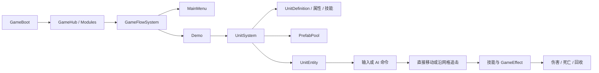

# Tiny Nations 项目简报

> 状态快照：2026-09-26
> 当前阶段：核心玩法垂直切片 / 技术原型  
> 项目分支：`main`

## 一句话概述

Tiny Nations（小小国家）是一款基于 Unity 6 的 2D 小规模 RTS 原型。当前保留演示场景、单位生成与直接移动、近战技能、伤害和死亡回收；旧寻路已清理，新网格地图已接入 Demo 场景。

## 项目概况

| 项目项 | 当前情况 |
| --- | --- |
| 引擎 | Unity `6000.6.0f1` |
| 渲染与内容形态 | URP 17.7、2D 像素风资源 |
| 核心架构 | BorFramework + GameLogic，采用 Module、GameSystem、ELC、FSM 分层 |
| 资源系统 | YooAsset，业务通过资源地址和租约访问资源 |
| 异步方案 | UniTask |
| 输入方案 | Unity Input System |
| UI | uGUI + 项目内 MVVM 与导航栈 |
| 当前内容规模 | 7 个 UnitDefinition、7 个单位 Prefab；导航测试场景已移除 |

## 当前已形成的核心能力

### 1. 框架与流程

- `GameBoot` 作为应用组合根，负责模块注册、业务 System 组装和 Unity 帧回调转发。
- `GameFlowSystem` 通过状态机串联主菜单与 Demo 场景。
- 框架已提供日志、事件、输入、实体、资源、Prefab 池、场景、UI 和业务系统生命周期；存档与通用配置暂无实现，不注册占位模块。
- 框架层保持玩法无关，单位和游戏流程位于 `GameLogic`。

### 2. 数据驱动单位

- 已配置 Minotaur、PaddleFish、Panda、PigRider、Skull、Spider、WarriorBlue 共 7 个单位。
- 单位差异主要由 `UnitDefinition`、属性配置、技能配置、Animator Controller 和动画资源表达。
- 通用 `UnitEntity` 组合输入、移动、技能、效果、队伍、生命和表现逻辑，避免为每个兵种复制一套代码。
- 开发版调试面板可按 UnitDefinition 发现并生成单位，便于快速验证内容配置。

### 3. 战斗运行时

- 已具备玩家移动、近战攻击、防御、属性与 GameEffect 结算链路。
- 运行时 `TeamId` 支持 Self、Ally、Enemy 关系判断，近战技能可按目标关系过滤。
- 伤害事件、受击闪白、生命状态和死亡事件已接入。
- 死亡单位在当帧 `LateUpdate` 安全移除，避免更新集合期间重入销毁。
- 单位 GameObject 由 Prefab 池复用；每次生成重新建立业务运行时状态，回收时释放相应资源租约。

### 4. 导航现状与近战 AI

- 旧寻路逻辑已移除。新 `NavigationMap` 按 `Ground` Tile 建立格子，再用 `Collision` Tile 标记禁行；Demo 进入时注册 `INavigationSystem`，退出时移除。
- 当前导航以静态格子执行八方向路径搜索，按单位身体半径检查障碍净空与拐角；近战 AI 预约目标周围的站位，移动时对邻近单位做局部分离。单位身体之间尚无硬阻挡。
- 当前近战 AI 可定期寻找最近敌人、保持目标、沿 Ground/Collision 网格接近目标，进入攻击范围后停步并触发主技能；运行效果待验收。

> 地图构建、追逐与战斗目前只做静态检查；实际移动和界面结果仍需 Unity 运行验收。

## 运行结构

## 进度判断

| 模块 | 状态 | 说明 |
| --- | --- | --- |
| 应用启动与模块生命周期 | 已落地 | 已形成统一组合根和启停释放流程 |
| 主菜单 → Demo 流程 | 已落地 | 状态机负责场景与 UI 切换 |
| 单位数据与资源规范 | 已落地 | 7 个单位已按统一规范配置 |
| 单位生成与对象池 | 已落地 | 资源加载、运行时创建与回收链路完整 |
| 基础近战、阵营、伤害与死亡 | 已实现，待完整运行验收 | 静态链路存在，仍需在当前版本验证事件顺序与回收行为 |
| 受击闪白 | 已实现，待视觉验收 | 需要在 Unity Game 视图确认最终效果 |
| 场景 Tilemap 导航 | 网格路径和近战站位已接入，待运行验收 | 静态障碍净空、八方向路径查询和局部分离已实现；无单位硬阻挡 |
| 近战自动索敌、追击与攻击 | 待运行验收 | 视野内目标可被追逐，进入攻击范围停步 |
| 完整 RTS 操作层 | 尚未开始 | 尚未形成框选、编队、Attack-Move、生产与经济闭环 |
| 联机与热更新 | 规划项 | 当前不应先于单机战斗垂直切片推进 |

## 当前风险与约束

1. **运行验收不足**：本次清理只经过静态检查，玩家移动、近战攻击、死亡和受击表现仍需要当前 Unity Play Mode 结果确认。
2. **追击运行验收待完成**：需在 Unity 中确认绕障碍、移动目标重新寻路、不可达时停止和进入射程停步。
3. **行为合同仍需固定**：自动索敌范围、目标保持、追击距离、脱战返回和玩家命令优先级会直接影响 AI 结构，应在增加复杂 AI 前明确。
4. **验收仍需覆盖退出路径**：框架文档已同步本轮契约；Stop/Start、更新中回收、无效配置、重复动画和加载失败恢复仍需实际运行验证。
5. **范围膨胀风险**：联网、完整阵营、经济、生产和战略 AI 都依赖稳定的单位战斗基础，不适合与当前垂直切片并行展开。

## 建议的下一阶段

### P0：收口当前战斗闭环

- 验证玩家直接移动；AI 对范围内目标能连续攻击，目标死亡后重新索敌。
- 验证致死伤害只触发一次死亡、当帧末回收，且再次生成同一 Prefab 无残留状态。
- 验证受击闪白不会污染共享材质，并在池化复用后恢复正确颜色。

### P1：固定最小 AI 行为合同

- 明确自动索敌、目标保持、追击上限和脱战返回规则。
- 明确玩家移动、攻击命令与自动 AI 的覆盖优先级。
- 在现有 Logic / Component 上完成最小实现，不提前引入行为树、GOAP、威胁表或编队系统。

### P2：扩展为可玩的 RTS 操作切片

- 增加单位选择与目标指令。
- 增加 Attack-Move 或等价的移动接敌命令。
- 用少量不同单位验证数据驱动技能和属性差异。
- 形成一段可重复演示的短战斗流程，再评估生产、经济、关卡和联网需求。

## 近期验收标准

当前阶段可以用以下结果判断“垂直切片完成”：

- 玩家可从主菜单进入 Demo，玩家单位稳定生成。
- 玩家单位可以直接移动；敌对近战单位会沿网格接近视野内目标，并在攻击范围内尝试攻击。
- 双方在正确距离内攻击，伤害、受击反馈和死亡只按预期触发。
- 死亡单位停止输入、移动与技能，并安全回收到 Prefab 池。
- 重复生成、战斗、死亡和回收后，无明显状态残留或持续报错。

## 关键资料入口

- 项目入口：`README.md`
- 框架概览：`Assets/Doc/FrameworkOverview.md`
- 框架 API 导航：`Assets/Doc/FrameworkNavigation.md`
- C# 与生命周期规范：`Assets/Doc/CodingStandards.md`
- Unity 目录规范：`Assets/Doc/DirectoryStandards.md`
- Unit 制作与运行时契约：`Assets/Doc/UnitPrefabAuthoring.md`
- 当前应用组合根：`Assets/Scripts/GameLogic/GameBoot.cs`
- 单位系统：`Assets/Scripts/GameLogic/Units/Systems/UnitSystem.cs`
- 场景单位系统：`Assets/Scripts/GameLogic/GameFlow/UnitSceneSystems.cs`

---

本简报按 2026-09-26 新网格地图接入后的源码更新。此次仅做静态检查，没有运行 Unity、进入 Play Mode 或执行编译，因此地图构建、运行与视觉结论仍待验证。
